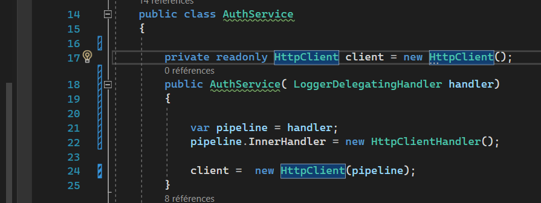

# Introduction 
        Ce projet a pour but de produire un de créer un 
        fournisseur de log customisé et customisable qui
        puisse repondre et s'adapter au besoin de n'importe
        quel projet

# Get started

## Installation
il y a deux façon de procéder  au téléchargement du package:
1. via nuget.org : https://www.nuget.org/packages/Logger.Logger/#readme-body-tab
2. via github : cloner le projet et l'ajouter comme reference de projet dans les projets appellant

Process installation Logger et utilisation:
1. <b><u>dans program.cs</u></b>
-  ajouter le middleware <b>LoggerMiddleware</b> avant les middlewares <b>UseAuthorization</b> et <b>MapControllers</b> avec la ligne de code: 

        app.UseALoggerMiddleware;

        app.UseHttpsRedirection();
        app.UseAuthorization();
        app.MapControllers();
        app.Run();

- ajouter les configuration du niveau de log par défaut avec la ligne

        builder.Services.Configure<LoggingConfiguration>(builder.Configuration.GetSection("Logging").GetSection("LogLevel"));

- ajouter l'intercepteur des requetes sortantes

        builder.Services.AddTransient<LoggerDelegatingHandler>();

        builder.Services.AddHttpClient("HttpMessageHandler").
        AddHttpMessageHandler<LoggerDelegatingHandler>();

2. <b><u>dans les controllers ou les endroits où logger</u></b>
- importer Logger comme suit:
        
        using LoggerService = Logger.Services.Implementations.Logger;
- initialiser votre objet logger :  

        private readonly LoggerService logger = new LoggerService(IOptions<LoggingConfiguration>);

        NB: le constructeur de l'objet prend en paramètre un objet de type IOptions<LoggingConfiguration> , donc il faudra l'initialiser dans votre controller

3.  <b><u>pour toutes les instances HttpClient</u></b>

dans toutes les classes et controllers où vous ferez appel à la classe **HttpClient** pour des appels externes:

- passer le service **LoggerDelegatingHandler** en paramètre dans le constructeur de la classe 
- passer la valeur **new HttpClientHandler()** au paramètre **InnerHandler** du service **LoggerDelegatingHandler** recupéré
- enfin passer le service **LoggerDelegatingHandler** en paramètre lors de la création de vos objets **HttpClient**

## Utilisation
la classe Logger est une implementation de l'interface ILogger avec les methode suivante:
1. logInformation(string message);
2. logDebug(string message);
3. logTrace(string message);
4. logWarning(string message);
5. logError(string message);